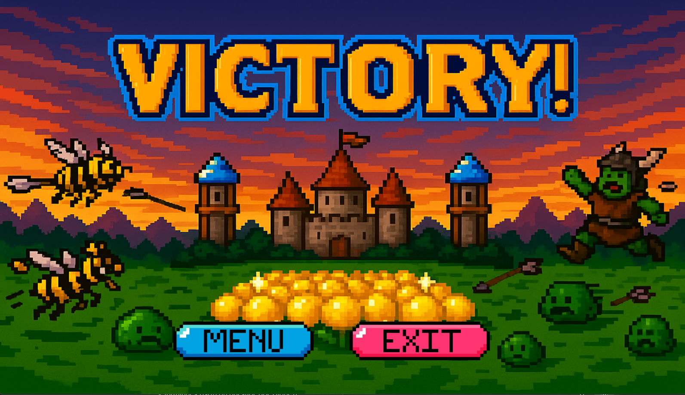

## Trabalho final: Desenvolvimento de jogos digitais (DCC192)
    Desenvolvimento de jogo estilo tower defense usando a biblioteca SDL 2.

### 1. Screenshots

### 2. Título: **Crop Guardian**

### 3. Descrição

*Crop Guardian* é um jogo tower defense em estilo pixel art, onde o jogador precisa proteger suas plantações contra ondas de inimigos como slimes, ogros e zangões. O jogador pode posicionar torres em locais estratégicos para derrotar os inimigos antes que alcancem a base.

O jogo apresenta uma fase inicial jogável com um menu principal, HUD com número de vidas, e controles simples para construção e navegação. A condição de derrota é a destruição da base (todas as vidas perdidas). A condição de vitória é resistir até o fim das ondas.

Durante o gameplay, o jogador ouve músicas e efeitos que ajudam na imersão. A transição entre as cenas é suavizada com animações de fade.

### 4. Funcionalidades a serem testadas

- Navegação no menu com som
- HUD com vidas e moedas funcionando
- Construção de torres em locais válidos
- Inimigos seguindo caminho e atacando
- Condição de derrota acionando tela de Game Over
- Música de fundo e efeitos sonoros

### 5. Créditos

- **Bruno Esteves Campoi** – Lógica dos inimigos, Portal, Torres
- **Frederico Baker** – HUD, Torres, Abelha, Níveis
- **Alexandre Silva de Menezes Guerra** – Menu, áudio, Game Over, Vitória

